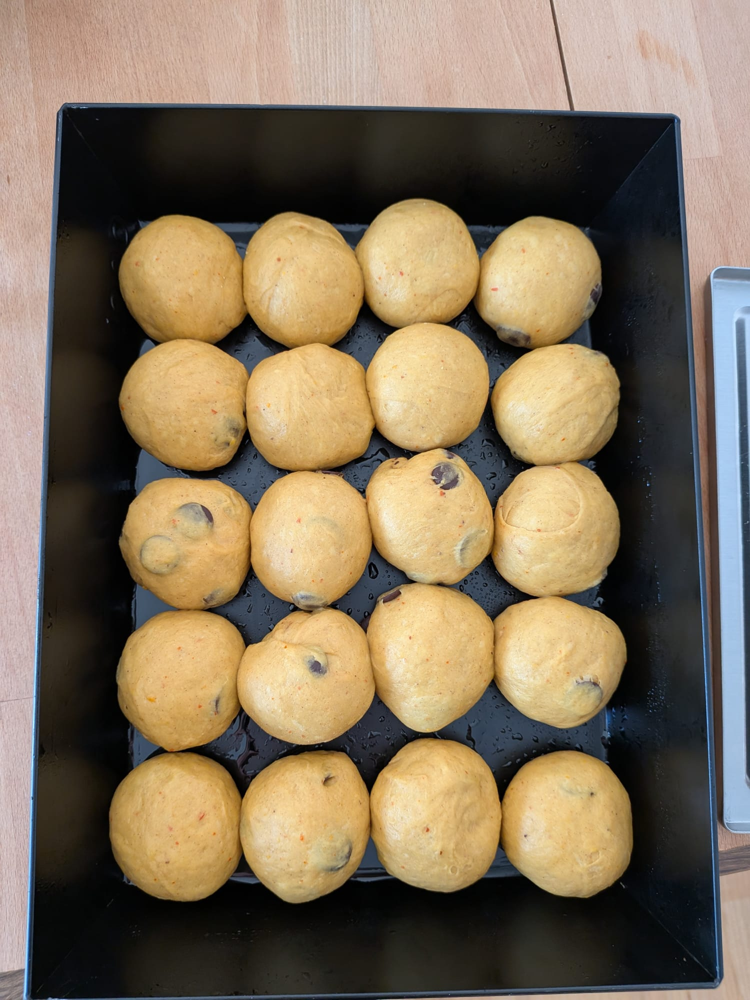
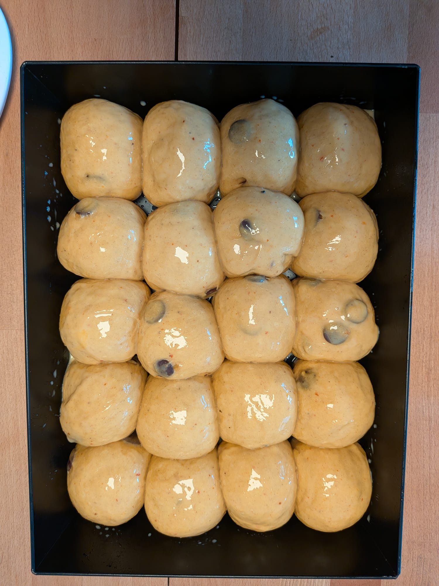
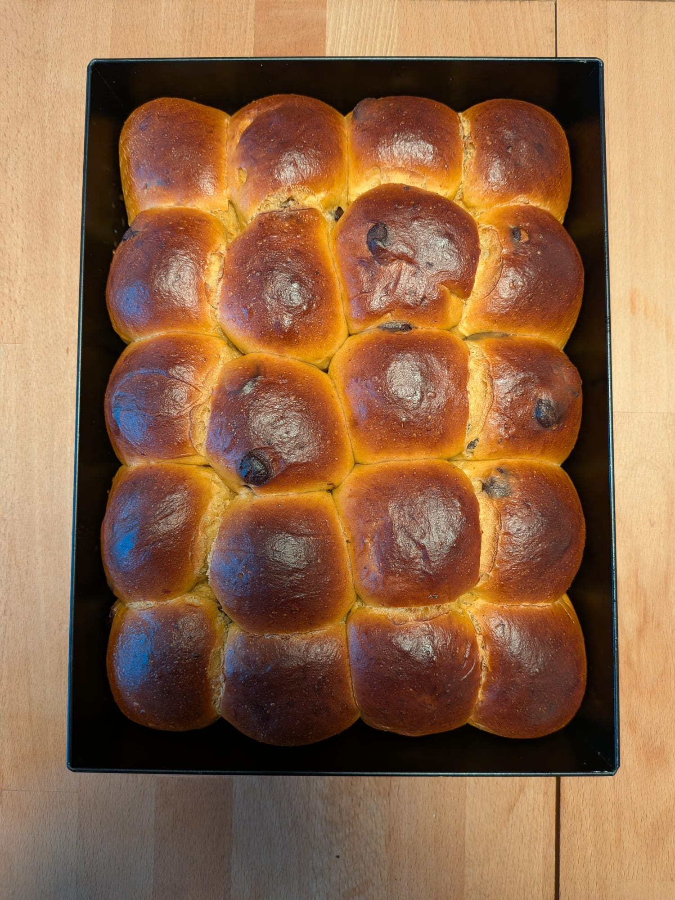

# Pumpkin Buns Recipe

## Ingredients
- 700g Flour Type 550
- 2 Eggs (medium), cold
- 180g Milk, cold
- 50g Butter, cold
- 150g sugar
- 3 tsp salt (12g)
- 140g (Hokkaido) Pumpkin baked until soft (weight after baking), cooled
- 30g fresh baking yeast
- 1 tsp Cinnamon, 1 tsp Pumpkin Pie Spice
- optional: Chocolate Bits (as much as you like, more = better)
- optional: egg yolk + milk for egg wash

## Utils
- Kneading machine (Good luck without)
- Deep backing dish (e.g. Ooni Detroit style pizza dish)
- Blending stick

## Method

- Blend milk, eggs, sugar and baked pumpkin with a stick blender.
- Add flour, salt and yeast to kneading machine.
- Slowly add blended ingredients and knead until dough is soft.
- Add cold butter in pieces and mix until incorporated.
- Ball up the dough and let rest for 2 hours.
- Spread out the dough add chocolate chips, fold dough back together and shape it into a ball again.
- Let the dough rest for 30 more minutes.
- Divide dough into 20 pieces of equal weight and shape into balls. Place into the baking dish greased with oil.
- Let rise for 2-3 hours.
- Optional: Mix egg yolk with same volume of milk and brush on the buns.
- Pre-heat oven to 220°C bake with steam for 20-25 minutes. After 10 minutes of baking reduce temperature to 160°C.

